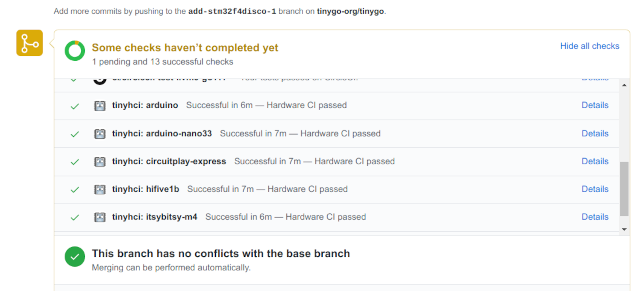

# TinyHCI

## Hardware Continuous Integration (HCI) System

Used to test actual hardware connections for microcontrollers. It is intended to provide smoke test implementations that exercise the basic functionality for each kind of hardware interface for each supported microcontroller.

Currently implemented integration tests for:

- Adafruit Circuit Playground Express (Microchip SAMD21x based on ARM Cortex-M0)
- Adafruit ItsyBitsy-M4 (Microchip SAMD51x based on ARM Cortex-M4)
- Arduino Nano33-IoT (Microchip SAMD21x based on ARM Cortex-M0)
- Arduino Uno (Atmel ATmega328p based on AVR)
- bbc:microbit (Nordic Semiconductor nRF51 based on ARM Cortex-M0)
- SiFive HiFive1 RevB (Freedom E310 based on RISC-V)
- Sipeed MAix BiT (Kendryte K210 based on RISC-V)
- STMicro STM32F407 Discovery (STMicro STM32F407VG based on ARM Cortex-M4)

## How it works



TinyHCI is a Github application that monitors commits to the TinyGo project, and then triggers tests of the physical hardware.

It uses the webhook interface using the Github Checks API to listen for requests to run check to the target repository, and then will do the following:

- [x] Create a Github check suite for the PR (https://developer.github.com/v3/checks/)
- [x] Create a new docker image that downloads and installs the binary build of TinyGo from CircleCI based on the pull request SHA
- [x] Flash the hardware tests onto each of the supported microcontroller boards using the docker image
- [x] Execute the hardware tests for each of the supported microcontroller boards using the test runner
- [x] Update the Github check run in the check suite for this SHA with the test results for each MCU to either "success" or "failed" based on the pass/fail for each as they are executed by the HCI system.

## Test Runner

The process of running the hardware tests is:

- compile the test code for that MCU
- flash test code onto the MCU
- use the `testrunner` to execute the tests.

One the MCU has been flashed with the test code, here is how it works with the `testrunner` program:

- MCU test program waits for a `t` keypress to be detected on the serial port
- The test runner connects via serial port to the MCU, then send a `t` key to test the MCU to start the tests
- MCU runs thru the hardware integration tests, outputting the results back out to the serial port
- The test runner then looks at the test results to determine if the suite passed or failed

```
./build/testrunner /dev/ttyACM0 115200 5

- digitalReadVoltage = ***pass***
- digitalReadGround = ***pass**
- digitalWriteOn = ***pass**
- digitalWriteOff = ***pass***
- analogReadVoltage = ***pass***
- analogReadGround = ***pass***
- analogReadHalfVoltage = ***pass***
- i2cConnectionNoPower = ***pass***
- i2cConnectionPower = ***pass***

### Tests complete.
```

### Digital I/O

The digital inputs and outputs are wired in a loopback form in order to test if the pins are outputting and reading the expected values. In addition, pins are wired to the voltage source, and ground, to ensure that all readings are returning known expected values.

### I2C

The I2C pins are wired to an MPU-6050 accelerometer to check if the device responds as expected when connected.

### ADC

Analog inputs are connected using a voltage divider made using two resistors. The reference voltage, reference divided by 2, and ground level voltage can then be read using the ADC.

### SPI

TODO

### PWM

TODO

### UART

## Docker containerized builds

We run each set of checks using a docker container with the associated `tinygo` binary for simplicity and greater security.

To build it:

```
docker build -t tinygohci -f tools/docker/Dockerfile --build-arg TINYGO_DOWNLOAD_URL=https://13064-136505169-gh.circle-artifacts.com/0/tmp/tinygo.linux-amd64.tar.gz .
```

Now we can use the `tinygohci:latest` image to build/flash our program.

```
docker run --device=/dev/ttyACM0 -v /media:/media:shared tinygohci:latest tinygo flash -target circuitplay-express examples/blinky1
```

## Why we created TinyHCI

We did not use [GoHCI](https://github.com/periph/gohci) because our requirements are a bit different. In our case the actual tests are executed on the microcontrollers themselves vs. being executed on various other connected machines. Also we wanted TinyHCI to be able to take advantage of the newer Checks API vs. the older Status API.

We also did not use the [Github Actions local runner](https://github.com/actions/runner) because we wanted more discreet control over the integration server, and also because we did not want to install all of the dependencies for .NET for Linux.

## Thanks

Thanks to [@maruel](https://github.com/maruel) for the work on GoHCI which has certainly been an influence on this project.

Also thanks to Github for providing code hosting and CircleCI for providing CI services that are the foundation for this project.

## License

This project has been licensed under the BSD 3-clause license, just like the Go and TinyGo projects.
